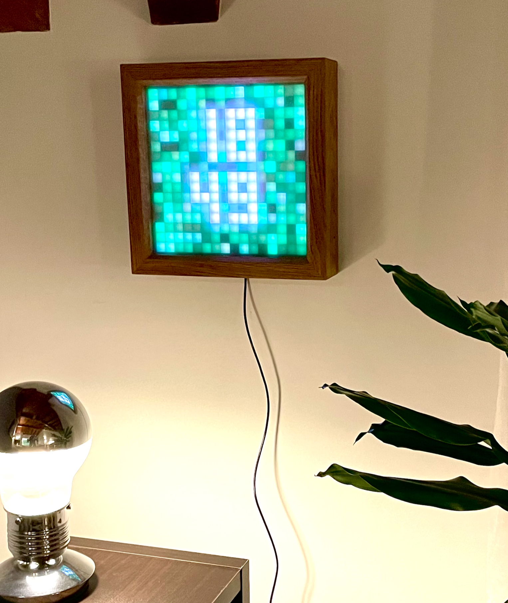

# zMatrix led matrix clock for ESPHome

This repository is for porting my 16x16 led matrix clock to esphome so
I can interact with it directly from automations.

It may work for other sizes with code modifications, here and there,
but I couldn't make it easier because of the arrays that would have
been dinamically allocated and I didn't want to have to manage that
for now.

If you want to use it you may also ave to change the XY(x, y) method
to map the leds you have

## Configuration

Configuration for ESPHome is done with a yaml code that would resemble this:

```yaml
substitutions:
  name: zmatrix
  friendly_name: zMatrix
  adcsensorpin: GPIO33
  lightpin: GPIO2

esphome:
  name: ${name}
  friendly_name: ${friendly_name}

esp32:
  board: esp32dev
  framework:
    type: arduino

logger:

api:
  encryption:
    key: !secrets api_key

ota:
  - platform: esphome
    password: !secrets ota_password

wifi:
  ssid: !secret wifi_ssid
  password: !secret wifi_password

packages:
  zmatrix:
     url: https://github.com/zubrick/zmatrix-esphome
     ref: main
     files: [ zmatrix.yaml ]
     refresh: 10min
```

### Hardware

To build this, I use :
* ESP32 devkit (but any esphome compatible device should work)
  [https://www.aliexpress.com/item/1005004637451669.html]
* RTC3231 module [https://www.aliexpress.com/item/1005007882794844.html]
* Pre-assambled WS2812 16x16 led matrix
  [https://www.aliexpress.com/item/4000544584524.html] or inividual
  WS2812B places in a 16x16 grid pattern on a board in a zigzag
  pattern starting top left
* I use a custom made pcb to hold the ESP32, the RTC module and
  previously also an SD card reader.
* A good power supply (at least 5V/2A, a bit more would be nice)
* A 1000µF capacitor between + and - to absorb spikes
* a 100k resistor and an LDR light sensor for auto brightness [https://www.aliexpress.com/item/32760631393.html]

If using the led matrix provided in the link, I have a 3D printed case
for it available on MakerWorld.com
[https://makerworld.com/en/models/1461440-zmatrix-case#profileId-1523869]

### Result




